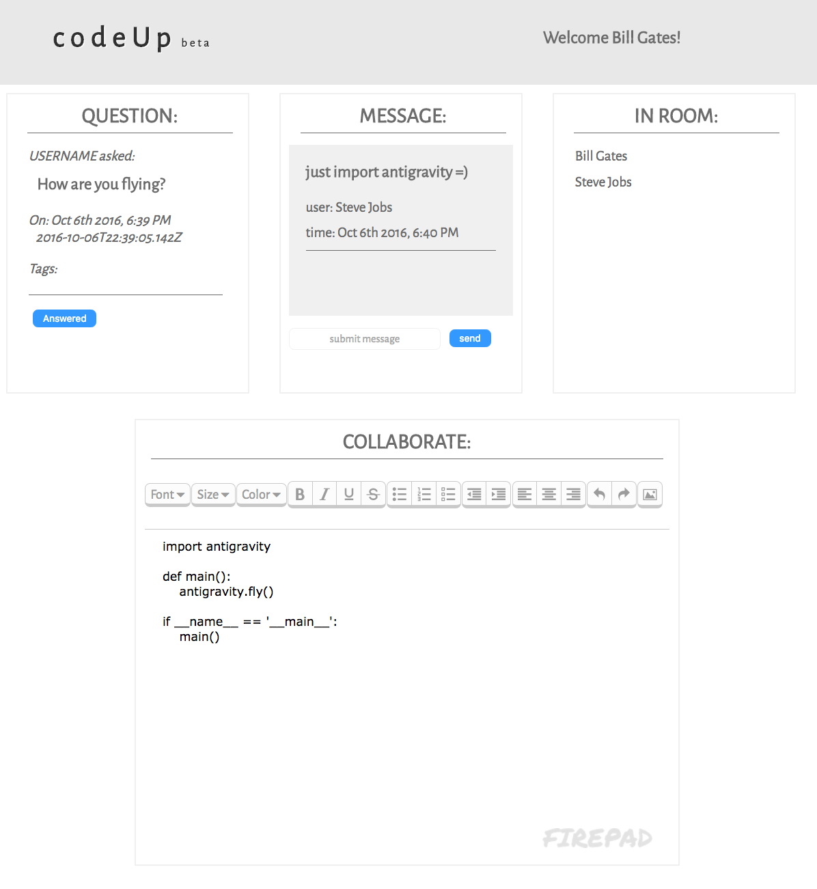

## codeUp (beta)
codeUp is a platform that provides answers to your programming and existential questions (e.g., how to fly) in a real-time, 1-on-1 environment by your peers and experts. It seamlessly integrates real-time, collaborative code editor and instant messaging with other users. Let's go learn how to fly!

To begin, register a user account or log in/authenticate with your GitHub credentials. Then ask your question, add relevant tags by topic, and see your question appear in a real-time lobby queue. Other users may then respond to your question and begin a 1-on-1 chat session to discuss and/or pair program solutions to your programming dilemma. Registration is not required, but you will be limited to only viewing posted questions as a guest user.

The backend is built on Node.js and serves the frontend "view" with event-based communication provided by Socket.io. The user interface is framed with React and Redux, dressed with collaborative-mojo freely provided by Firepad.io code editor in its open source fashion. PostgreSQL database provides bookkeeping on users, questions, topic tags, and chat messages so an expert can review chat logs to continue helping a user with their question from where another may have left off.

## Screenshots

## Live Deployment

Live demo can be seen at: https://officehours.herokuapp.com/#/?_k=3sm66a

## Local Setup

Steps for setting up codeUp locally.

### BACKEND:
Setting up the database and backend server.

	1. Install postgreSQL using homebrew:
			$ brew install postgresql

	2. Install postgreSQL node-module using NPM:
			$ npm install --save pg

	3. Launch postgreSQL using homebrew:
			$ brew services start postgresql

	4. In project directory, create new db:
			$ createdb *INSERT_DB_NAME*

	5. Connect model tables (schema.sql) db:
			$ psql -d *INSERT_DB_NAME* < *INSERT_SCHEMA.SQL_PATH*

	6. Access database:
			$ psql -d *INSERT_DB_NAME*

For example, once postgreSQL is installed and launched, type:
'''
	* `createdb chat`
	* `psql -d chat < backend/database/schema.sql`
	* `psql -d chat`
	* `insert into users (user_name) values ('Alex');`
	* `insert into questions (user_id, question_text, when_asked, is_answered) values (1, 'this is the questions text', '1999-01-08 04:05:06', false);`
'''

Queries for accessing the SQL database directly.

	Query examples:
		-REATE:
			$ insert into *INSERT_TABLE* (*INSERT_COLUMN_1*, *INSERT_COLUMN_2*) values ('*INSERT_VALUE_1*', '*INSERT_VALUE_2*');
			'1999-01-08 04:05:06' (format timestamp like this)
		READ:
			$ select * from *INSERT_TABLE*;
			$ select *INSERT_VALUE from *INSERT_TABLE*;
			$ select *INSERT_COLUMN_1*, *INSERT_COLUMN_2* from *INSERT_TABLE* where *INSERT_COLUMN_1*='*INSERT_VALUE_1*';
		UPDATE:
			$ update *INSERT_TABLE* set *INSERT_COLUMN_1*='*INSERT_VALUE_1*' where *INSERT_VALUE_2*='*INSERT_COLUMN_2*';
		DELETE:
			$ delete from *INSERT_TABLE* where *INSERT_COLUMN_1*='*INSERT_VALUE_1*';

## Authors

* [Ben Young](https://github.com/URL) - *Project Manager*

* [Alex Bang](https://github.com/URL) - *Front-End and Designer*

* [Sean Jun](https://github.com/URL) - *Co-Product Manager + CI/Testing*

* [Joe Seago](https://github.com/URL) - *Co-Product Manager + DevOps*

Also see the list of [contributors](https://github.com/seanjun21/code-roulette/contributors) for their specific commits to this project.

## Tech:

* [React](http://facebook.github.io/react)
* [Redux](http://redux.js.org)
* [Node](http:/nodejs.org/)
* [Socket](http://socket.io)
* [Firepad](https://firepad.io)
